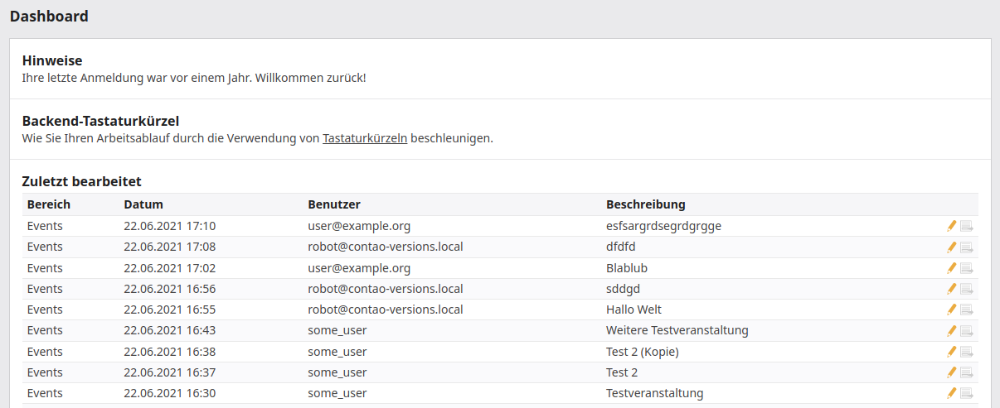

# Contao Advanced Dashboard Bundle

A bundle to add more flexibility to the contao backend dashboard.

## Features
- replaces the contao dashboard with a more customizable one
- customize the dashboard versions list to your need, like changing the visibility of user and tables or add custom columns



## Usage

### Install  

1. Install with composer or contao manager

        composer require heimrichhannot/contao-advanced-dashboard-bundle

1. Update database

### Customize dashboard versions list.

A main feature of this bundle is the customization of the versions log in the contao dashboard. After installing this bundle, you'll find, that there is no difference to the original contao dashboard, as the default configurations are the same. But now you can create configurations thats specify which logs are displayed to a user filtered by user or table. You can also specify which columns are displayed. 

1. Setup a versions_right configuration in your projekt config, typically `config/config.yml`

```yaml
huh_advanced_dashboard:
  versions_rights:
    # All user changes visible for table tl_news.
    editor_news:
      user_access_level: all
      columns:
        - date
        - user
        - table
        - id
        - description
        - version
        - actions
      tables:
        - tl_news
```

1. Clear your cache if not in dev mode

1. Apply the created right in user or user group settings to a user or user group.

Additional notes:
- If no configuration is defined, or a user has no configuration added, a default configuration is used. You can customize the default configuration by creating a configuation with the name default.
- Restriction are not applied to admin user.

## Developers

### Add new columns or change the appearance of existing columns

There are two events of add custom columns to the versions log or change existing columns. 

Maybe you have an extension that expands the version table and adds more information to a version log and want to output that information in the version log. We recommend creating a Subscriber for `VersionListDatabaseColumnsEvent` and `VersionListTableColumnsEvent`.

```php
use HeimrichHannot\AdvancedDashboardBundle\Event\VersionListDatabaseColumnsEvent;
use HeimrichHannot\AdvancedDashboardBundle\Event\VersionListTableColumnsEvent;
use Symfony\Component\EventDispatcher\EventSubscriberInterface;

class AdvancedDashboardEventSubscriber implements EventSubscriberInterface {
    
    public static function getSubscribedEvents(){
        return [
            VersionListDatabaseColumnsEvent::class => 'onVersionListDatabaseColumnsEvent',
            VersionListTableColumnsEvent::class => 'onVersionListTableColumnsEvent',
        ];
    }
    
    // Add additional database columns that should be fetched (or modify existing values)
    public function onVersionListDatabaseColumnsEvent(VersionListDatabaseColumnsEvent $event) {
        $event->addColumn('custom_information');
    }
    
    // Add additional columns to the version list.
    // `label` is the table column headline
    // `renderCallback` is the method that renders the content of the current column.
    //                  Gets the database values for the current row as parameter.
    public function onVersionListTableColumnsEvent(VersionListTableColumnsEvent $event) {
        $event->setColumn('custom_colum', [
            'label' => 'Custom information', 
            'renderCallback' => function(array $version) {
                return $version['custom_information'] ?: 'No custom information';
            }
         ]);
    }
}
```

## Configuration reference
```yaml
# Default configuration for extension with alias: "huh_advanced_dashboard"
huh_advanced_dashboard:

    # Configure user rights for version list. Can be selected in the user and user group settings.
    versions_rights:

        # Prototype: The title of the configuration. Should be a unique alias/name containing just 'a-z0-9-_' like 'all_users','editor_news'.
        name:

            # Allowed version table columns. Empty means all columns are allowed.
            columns:

                # Defaults:
                - date
                - user
                - table
                - id
                - description
                - version
                - actions

            # Allowed database tables. Empty means all tables are allowed.
            tables:               []

            # Access rights for other users version logs.
            user_access_level:    [self] # One of "all"; "self"
```