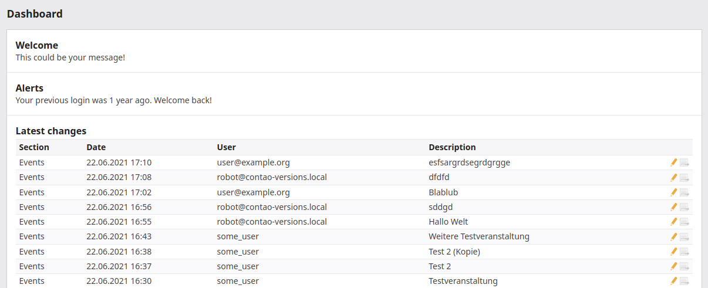

# Contao Advanced Dashboard Bundle

Customize the Contao back end dashboard and control which version-log entries are visible to back end users.

## Features

- Replaces the Contao dashboard with an extensible native Twig template.
- Restricts version entries by user and database table.
- Provides an event for customizing version rows.



## Requirements

- PHP 8.1 or newer
- Contao 5.3 or newer

## Installation

Install the bundle with Composer or the Contao Manager and then update the database:

```bash
composer require heimrichhannot/contao-advanced-dashboard-bundle
```

## Configure version rights

Add one or more `versions_rights` entries to the project configuration, usually in `config/config.yaml`:

```yaml
huh_advanced_dashboard:
  versions_rights:
    # Show changes from all users, but only for tl_news.
    editor_news:
      user_access_level: all
      tables:
        - tl_news
```

Clear the application cache, then assign the new version right in the settings of a back end user or user group.

If no assigned configuration matches, the bundle uses the `default` configuration. Administrators are always unrestricted. An empty `tables` list means that all tables are allowed.

## Customize the dashboard template

The dashboard uses Contao's native template hierarchy. Create `templates/be_advanced_dashboard.html.twig` and extend the bundle template:

```twig



    <section id="tl_custom_welcome">
        <h2>Welcome</h2>
        <p>This could be your message!</p>
    </section>




```

The following blocks are available:

- `dashboard`
- `dashboard_top`
- `messages`
- `before_shortcuts`
- `shortcuts`
- `before_versions`
- `versions`
- `dashboard_bottom`
- `credits`

The old position and visibility variables and the Twig Support Bundle events are no longer supported.

## Customize version rows

Use `VersionListRowEvent` to modify each prepared version row:

```php
<?php

declare(strict_types=1);

namespace App\EventListener;

use HeimrichHannot\AdvancedDashboardBundle\Event\VersionListRowEvent;
use Symfony\Component\EventDispatcher\EventSubscriberInterface;

class AdvancedDashboardEventSubscriber implements EventSubscriberInterface
{
    public static function getSubscribedEvents(): array
    {
        return [
            VersionListRowEvent::class => 'onVersionListRow',
        ];
    }

    public function onVersionListRow(VersionListRowEvent $event): void
    {
        $event->row['description'] = strtoupper((string) $event->row['description']);
    }
}
```

Override the dashboard template if you need to render additional row values or table columns.

## Configuration reference

```yaml
huh_advanced_dashboard:
  versions_rights:
    name:
      # Empty means all tables.
      tables: []

      # One of "all" or "self".
      user_access_level: self
```
